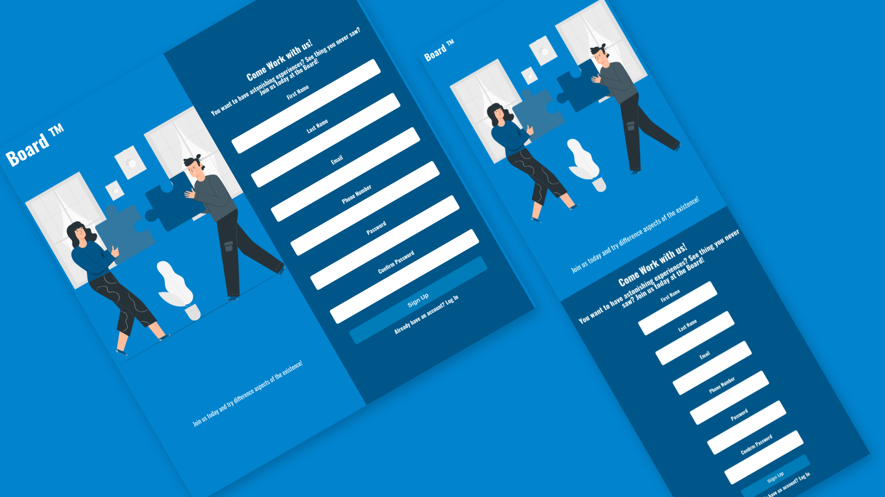

# Project Sign Up Form

## Description

This project is a sign up form for a fictional company called "Board". It was built using HTML, CSS, and JavaScript. The form is responsive and has client-side validation.

This project is part of the [The odin project](https://www.theodinproject.com/lessons/node-path-intermediate-html-and-css-sign-up-form) curriculum, which is a free open source full stack web development course.

## Preview

## Live Demo

[Live Demo Link](https://mrescappe.github.io/PROJECT-Sign-up/)

## Features

- Responsive design
- Client-side validation
- Form submission
- Mobile first design

## Built with

- 
- 
- 

## What I learned

- I learned more about HTML forms and how to use them.
- I learned how to use the `required` attribute to make fields required.
- I learned more about flexbox and how to use it to create responsive layouts.
- I learned more how to use media queries to make a website responsive.

## Author

👤 **José Sérgio**
